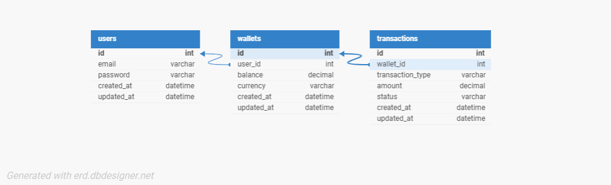

# Lendsqr Wallet Service

This project provides a wallet management service with functionalities such as creating wallets, funding wallets, transferring funds, and withdrawing balances. The application is built with Node.js, TypeScript, and Knex.js ORM, and it uses MySQL as its database. This service offers an intuitive API and implements robust security measures, including JWT-based authentication. It’s designed with a layered architecture, ensuring code modularity and ease of maintenance.

## Table of Contents

- [Project Overview](#project-overview)
- [Features](#features)
- [ER Diagram](#er-diagram)
- [Tech Stack](#tech-stack)
- [Getting Started](#getting-started)
- [Project Structure](#project-structure)
- [API Endpoints](#api-endpoints)
- [Database Schema](#database-schema)
- [Testing](#testing)
- [Contributing](#contributing)
- [License](#license)

## Project Overview

The **Lendsqr Wallet Service** provides a reliable and scalable solution for managing digital wallets. It is designed to handle the core financial operations of wallet systems, including:

- User registration
- Wallet creation and management
- Wallet funding, transfers, and withdrawals
- Transaction history tracking

The code follows best practices, including TypeScript typing for safer development, unit tests for critical functionalities, and an organized architecture.

## Features

- **User Authentication**: JWT-based authentication system for securing user data.
- **Wallet Management**: CRUD operations for wallets.
- **Transaction Processing**: Ability to fund, transfer, and withdraw from wallets.
- **Transaction History**: Detailed logging of all transactions.
- **Type Safety**: Built with TypeScript, ensuring code reliability and maintainability.
- **Testing Suite**: Comprehensive unit and integration tests for key functionalities.

## ER Diagram

The database design ensures data integrity and efficient access patterns. The following Entity-Relationship (ER) Diagram illustrates the relationships among the primary tables in the system:



1. **Users**: Stores user information and credentials.
2. **Wallets**: Manages wallet data, linked to specific users.
3. **Transactions**: Logs all transaction records, linked to specific wallets.

## Tech Stack

- **Node.js**: JavaScript runtime for building server-side applications.
- **Express.js**: Web application framework for Node.js.
- **TypeScript**: Superset of JavaScript that provides static typing.
- **Knex.js**: SQL query builder for interacting with the MySQL database.
- **MySQL**: Relational database for storing user, wallet, and transaction data.
- **Jest**: JavaScript testing framework for unit and integration tests.
- **Supertest**: HTTP assertions for integration testing.

## Getting Started

### Prerequisites

- **Node.js** (>=14.x)
- **MySQL** (>=8.x)

### Installation

1. **Clone the repository**

   ```bash
   git clone https://github.com/your-username/lendsqr-wallet-service.git
   cd lendsqr-wallet-service
   ```

2. **Install dependencies**

   ```bash
   npm install
   ```

3. **Environment Variables**

   Create a `.env` file in the root directory and configure the following environment variables:

   ```plaintext
   DB_HOST=your_database_host
   DB_USER=your_database_user
   DB_PASSWORD=your_database_password
   DB_NAME=your_database_name
   JWT_SECRET=your_jwt_secret
   PORT=your_preferred_port
   ```

4. **Database Migration**

   Run Knex migrations to set up the database tables:

   ```bash
   npx knex migrate:latest --knexfile src/config/database.ts
   ```

5. **Start the Server**

   ```bash
   npm start
   ```

   The server should now be running on `http://localhost:<PORT>`

## Project Structure

This project follows a modular structure to ensure code organization, maintainability, and scalability.

```plaintext
├── src
│   ├── config            # Database and environment configuration
│   ├── controllers       # Request handlers for each API route
│   ├── middleware        # Authentication and validation middlewares
│   ├── services          # Business logic for wallet and user operations
│   ├── models            # Database schemas and queries
│   ├── routes            # API route definitions
│   ├── utils             # Utility functions
│   └── tests             # Unit and integration tests
├── .env                  # Environment configuration
├── knexfile.ts           # Knex configuration for database migrations
└── package.json          # Node.js project configuration
```

## API Endpoints

### User Routes

- `POST /api/v1/users/register` - Register a new user
- `POST /api/v1/users/login` - Authenticate user and issue JWT token

### Wallet Routes

- `POST /api/v1/wallets/:walletId/fund` - Fund a wallet with a specified amount
- `POST /api/v1/wallets/transfer` - Transfer funds between wallets
- `POST /api/v1/wallets/:walletId/withdraw` - Withdraw funds from a wallet
- `GET /api/v1/wallets/:walletId/balance` - Check the balance of a wallet

## Database Schema

The database schema is structured as follows:

### Users Table

| Column       | Type       | Description              |
| ------------ | ---------- | ------------------------ |
| `id`         | `int`      | Primary key              |
| `email`      | `varchar`  | User's email address     |
| `password`   | `varchar`  | Encrypted password       |
| `created_at` | `datetime` | Timestamp of creation    |
| `updated_at` | `datetime` | Timestamp of last update |

### Wallets Table

| Column       | Type       | Description                   |
| ------------ | ---------- | ----------------------------- |
| `id`         | `int`      | Primary key                   |
| `user_id`    | `int`      | Foreign key referencing users |
| `balance`    | `decimal`  | Wallet balance                |
| `currency`   | `varchar`  | Wallet currency               |
| `created_at` | `datetime` | Timestamp of creation         |
| `updated_at` | `datetime` | Timestamp of last update      |

### Transactions Table

| Column             | Type       | Description                                    |
| ------------------ | ---------- | ---------------------------------------------- |
| `id`               | `int`      | Primary key                                    |
| `wallet_id`        | `int`      | Foreign key referencing wallets                |
| `transaction_type` | `varchar`  | Type of transaction (fund, transfer, withdraw) |
| `amount`           | `decimal`  | Transaction amount                             |
| `status`           | `varchar`  | Status of transaction (completed, pending)     |
| `created_at`       | `datetime` | Timestamp of transaction creation              |
| `updated_at`       | `datetime` | Timestamp of last update                       |

## Testing

The project includes a comprehensive suite of tests to ensure robust functionality across all services and modules.

### Running Tests

1. **Unit Tests**

   ```bash
   npm run test:unit
   ```

2. **Integration Tests**
   ```bash
   npm run test:integration
   ```

Tests are located in the `src/__tests__` folder, organized by feature and functionality.

### Code Coverage

The test suite also provides code coverage reports, ensuring that all critical code paths are tested. Run the following command to generate a coverage report:

```bash
npm run test:coverage
```

## Contributing

Contributions are welcome! To contribute:

1. Fork the project.
2. Create a new branch for your feature or fix.
3. Commit your changes.
4. Open a pull request with a detailed description.

## License

This project is licensed under the MIT License. See the [LICENSE](LICENSE) file for details.
